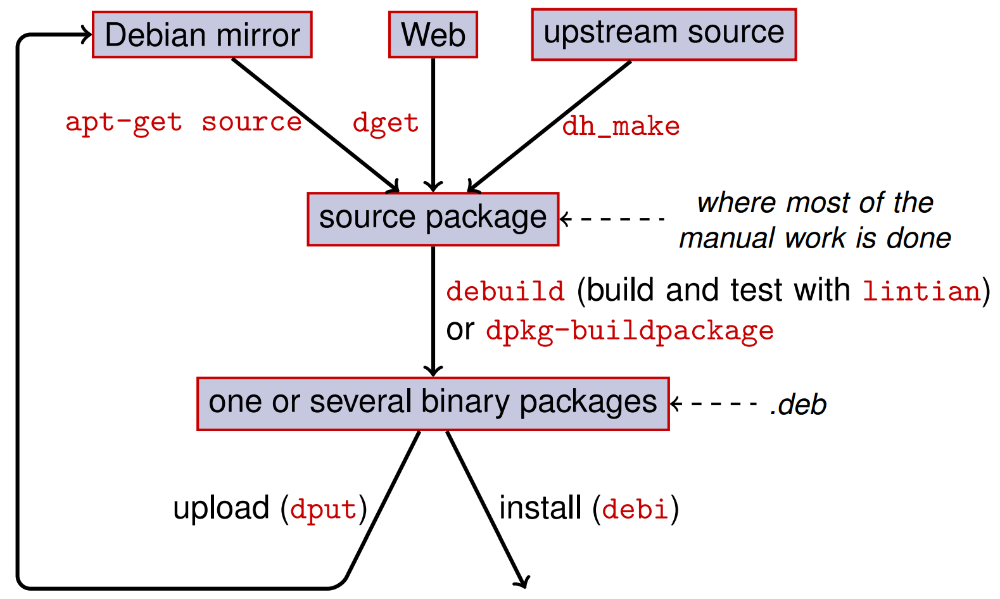

:css: ./default.css
:skip-help: true

.. title:: Debian packaging

Debian packaging
================

Filip Pytloun
-------------

----

Filesystem Hierarchy Standard
=============================

- First release introduced on 14 February 1994, 21 years ago
- Last release is 3.0, introduced on 3 June 2015

- FHS enables to predict location of installed files and directories for both
  software and users
- defines guiding principles for each area of the filesystem

- most Linux distributions follows and enforce the standard

----

Basic rules
-----------

- root directory should be as smallest as possible to allow boot from media
  with limited size
- static and dynamic parts of filesystem should be separated (eg. ``/usr`` vs.
  ``/var``)
- shareable and unshareable data should be separated (eg. ``/usr`` or
  ``/var/mail`` vs. ``/etc`` or ``/var/run``)
- architecture-independent data should be separate from architecture-dependent
  ones (eg. ``/usr/share`` vs. ``/usr/lib``)

----

Sidenote
--------

Use term `directory` instead of `folder` when you are talking about Unix-like
system.

- it's traditional Unix naming
- term `folder` was introduced in Windows NT and Mac OS

  - probably to be more user-familiar as user see folders in Explorer or
    Finder
  - *..but I don't see any "folders" when I open terminal*

Also there's no `command line` in Unix-like systems, but `shell`, `console` or
`terminal`.

----

.. list-table::
   :header-rows: 1

   *  - **Directory**
      - **Description**
   *  - ``/bin``
      - essential command binaries, executables needed in single-user mode
   *  - ``/boot``
      - static files for the boot loader
   *  - ``/dev``
      - device files which refer to physical devices
   *  - ``/etc``
      - host-specific system configuration
   *  - ``/home``
      - users home directories
   *  - ``/lib``
      - essential shared libraries and kernel modules, necessary to boot the
        system
   *  - ``/media``
      - mount points for removable media
   *  - ``/mnt``
      - mount points for temporarily mounted filesystems
   *  - ``/opt``
      - addon packages that contain static files
   *  - ``/proc``
      - mount point for `proc` filesystem which provides informations about
        running processes and kernel
   *  - ``/root``
      - home directory of root user
   *  - ``/sbin``
      - similar to ``/bin`` but used for executables mostly not used by
        regular users.
        Eg. executables that requires root privileges.
   *  - ``/srv``
      - site-specific data that are served on the system
   *  - ``/tmp``
      - temporary files

----

.. list-table::
   :header-rows: 1

   *  - **Directory**
      - **Description**
   *  - ``/usr``
      - used to store sharable, read-only data, can be shared by multiple
        systems, strictly static content
   *  - ``/usr/bin``
      - primary directory for executable programs, executable by regular users
        and not needed for booting or repairing the system
   *  - ``/usr/include``
      - include files for the C compiler
   *  - ``/usr/lib``
      - object libraries, including dynamic libraries and some executables
        which are usually not invoked directly
   *  - ``/usr/local``
      - local programs for specific system,
        separated root structure
   *  - ``/usr/sbin``
      - program binaries for system administrators which are not required to
        boot or repair the system
   *  - ``/usr/share``
      - application data which can be shared among different architectures

----

.. list-table::
   :header-rows: 1

   *  - **Directory**
      - **Description**
   *  - ``/var``
      - variable data, `spool`, log files, etc.
   *  - ``/var/cache``
      - data cached for programs
   *  - ``/var/lib``
      - variable state information for programs
   *  - ``/var/lock``
      - lock files
   *  - ``/var/log``
      - log files
   *  - ``/var/mail``
      - user mailboxes
   *  - ``/var/run``
      - run-time variables files, files holding PIDs, usually cleared when
        system boots
   *  - ``/var/spool``
      - spooled or queued files for various programs, eg. cron, mail queue,
        etc.

----

Example program
===============

::

    /usr/share/doc/hello-debian/
    /usr/share/doc/hello-debian/changelog.gz

    /usr/share/hello-debian/templates/
    /usr/share/hello-debian/templates/base.html

    /etc/hello-debian/
    /etc/hello-debian/hello.ini

    /var/log/hello-debian/
    /var/log/hello-debian/access.log
    /var/log/hello-debian/error.log

    /var/lib/hello-debian/
    /var/lib/hello-debian/data

    /usr/lib/python2.7/dist-packages/hello_debian/
    /usr/lib/python2.7/dist-packages/hello_debian/__init__.py
    /usr/lib/python2.7/dist-packages/hello_debian-1.0.egg-info/
    /usr/lib/python2.7/dist-packages/hello_debian-1.0.egg-info/{PKG-INFO,..}

    /usr/bin/hello-debian

----

Debian packages
===============

- one of the two most common packaging formats (together with RPM)
- ``.deb`` files for binary packages

  - simple ``ar`` archive

    ::

        $ ar tv contrail-f5_2.20-64_all.deb
        rw-r--r-- 0/0      4 Jun 25 10:20 2015 debian-binary
        rw-r--r-- 0/0   1897 Jun 25 10:20 2015 control.tar.gz
        rw-r--r-- 0/0  87048 Jun 25 10:20 2015 data.tar.xz

    - ``debian-binary``: version of deb file format
    - ``control.tar.gz``: metadata (control, changelog, postinst, etc.)
    - ``data.tar.xz``: package content (basically just extracted into /)

      ::

          tar xvf data.tar.xz -C /

----

----

Source package
==============

- one source package can generate multiple binary packages
- two kinds of source packages

  - `native` for Debian specific software
  - `non-native` for software developed outside Debian

Format
------

- defined in ``debian/source/format``

- main file: ``.dsc``
- ``1.0`` or ``3.0 (native)``: ``<name>_<version>.tar.gz``
- ``1.0 (non-native)``

  - ``<name>_<version>.orig.tar.gz`` - upstream source
  - ``<name>_<version>.diff.gz`` - Debian-specific patches

- ``3.0 (quilt)``

  - ``<name>_<version>.orig.tar.gz`` - upstream source
  - ``<name>_<version>.debian.tar.gz`` - debian changes

----

Get and explore source package
==============================

- to get source package from apt repository

  .. code-block:: bash

     apt-get source <package>

- to get source package from the internet

  .. code-block:: bash

     dget http://<url>/<package>.dsc

- extract it (``apt-get source`` has already done this for you)

  .. code-block:: bash

     dpkg-source -x <package>.dsc

Now you have ``<package>-<version>`` directory with upstream source and
``debian`` directory which is important for us. All the packaging work is
done in this directory. You don't need to touch anything else.

----

Files in ``debian/``
====================

debian/rules
    Debian makefile

debian/changelog
    package changelog, this file defines package version

debian/copyright
    copyright information for the package

debian/control
    package informations, dependencies, etc.

debian/compat
    debhelper compatibility level

----

debian/watch
    file with definition for `uscan`, used to monitor new upstream versions.
    See `debian/watch <https://wiki.debian.org/debian/watch>`_ for more
    informations.

debian/source/format
    format of source packages
    ``3.0 (native)`` for native packages or ``3.0 (quilt)`` that will apply
    patches in debian/patches directory. Quilt format build is different from
    native, and using git-buildpackage. See `gbp manual <http://honk.sigxcpu.org/projects/git-buildpackage/manual-html/gbp.import.html#GBP.BRANCH.NAMING>`_ for more details.

debian/install, debian/dirs
    list of files and directories, installed by the package

debian/postinst, debian/prerm, ..
    installation and removal scripts

debian/patches/
    modifications of upstream sources

----

``debian/control``
==================

This is probably most important file in debian package.
It defines packages that should be build, it's dependencies, architectures, etc.

An example may look like this:

.. code::

    Source: hbsd
    Section: net
    Priority: extra
    Build-Depends: debhelper (>= 7)
    Maintainer: Filip Pytloun <filip.pytloun@tcpcloud.eu>
    Standards-Version: 3.9.6

    Package: hbsd
    Architecture: all
    Depends: ${shlibs:Depends}, ${python:Depends}, cinder-volume
    Enhances: cinder-volume
    Description: Hitachi Block Storage Driver for OpenStack

----

``debian/changelog``
====================

- lists debian packaging changes
- gives current version of the package

  - ``1.16-1`` (``<upstream>-<debian>``)
  - ``1.0-0ubuntu1`` (package in Ubuntu, not in Debian)
  - ``1.0-1ubuntu3`` (3rd ubuntu revision of 1st Debian release)

- can be edited manually or using ``dch`` tool

.. code::

   wget (1.16-1) unstable; urgency=medium

     * new upstream release from 2014-10-27
       - "Poodle" do not use SSLv3 except explicitely requested (CVE-2014-3566)
     * debian/control: Public Suffix List cookie domain checking via libpsl
       Closes: #766780
     * debian/control: updated Standards-Version to 3.9.6 (no changes needed)

    -- Noël Köthe <noel@debian.org>  Mon, 27 Oct 2014 11:29:29 +0100

----

Using ``dch``
-------------

Setup environment
    dch takes following environment variables to generate changelog entries

    .. code-block:: bash

       export DEBEMAIL="filip.pytloun@tcpcloud.eu"
       export DEBFULLNAME="Filip Pytloun"

Create release for distribution trusty
    .. code-block:: bash

       dch --distribution trusty -l tcp

Simply increment version, based on last changelog entry
    .. code-block:: bash

       dch --distribution trusty -R

New version entry
    .. code-block:: bash

       dch --distribution trusty -v 1.66-0tcp1

----

``debian/rules``
================

- simple makefile
- package helper (``dh7`` aka ``debhelper7``) is usually used

  - factors common tasks in standard tools used by all packages
  - third-party helpers, eg. ``dh-python``, ``dh-virtualenv``, etc.
  - so you put ``7`` in ``debian/control``

.. code-block:: make

    #!/usr/bin/make -f

    %:
        dh $@

    override_dh_auto_configure :
        dh_auto_configure -- -- with - kitchen - sink

    override_dh_auto_build :
        make world

----

Building package
================

Install build dependencies for given package
    .. code-block:: bash

       apt-get build-dep <package>

       # Or if package is not in Debian yet (install devscripts)
       mk-build-deps -ir

Build, test with lintian, sign with GPG
    .. code-block:: bash

       debuild

Build, no test, no signing
    .. code-block:: bash

       dpkg-buildpackage -uc -us

This will generate ``*.deb`` and ``*.changes`` files.

- ``*.changes`` file describes what was built and is used to upload the
  package
- ``*.deb`` is complete binary package ready to install

It's better to build packages in clean chrooted environment using eg. Pbuilder.

----

Using ``git-buildpackage``
==========================

- packaging using version control system

- ``Vcs-*`` fields in ``debian/control`` to identify repository

  ::

     Vcs-Browser: https://github.com/tcpcloud/package
     Vcs-Git: git://github.com:tcpcloud/package.git

- heavily using branches and tags

  - branches are configurable, instead of ``master`` you can use
    ``debian/unstable`` to separate distributions
  - there are also some more, mostly temporary branches

  ``upstream``
      branch with upstream code, with ``upstream/<version>`` tags

  ``master``
      branch tracking debian package

  ``debian/<version>``
      tags for each upload (eg. ``debian/1.0-1ubuntu3``)

----

Building Python module from Pypi
================================

Install requirements
    .. code-block:: bash

       apt-get install build-essential python-stdeb dh-python python-pbr git-buildpackage

Download source from pip
    .. code-block:: bash

       pypi-download jenkins-job-builder --release 1.1.0

    ``pypi-download`` is not present in trusty so you may need to download it
    manually from pypi

    .. code-block:: bash

       wget http://pypi.debian.net/jenkins-job-builder/jenkins-job-builder-1.1.0.tar.gz

----

Generate source package automatically with py2dsc
   .. code-block:: bash

       py2dsc -d . -m 'Filip Pytloun <filip.pytloun@tcpcloud.eu>' jenkins-job-builder-*.tar.gz

.. attention:: python-stdeb is broken in trusty, install newer from vivid

Initialize git repository and import source package
    .. code-block:: bash

       git init jenkins-job-builder; cd jenkins-job-builder
       gbp import-dsc ../jenkins-job-builder_*.dsc

----

Now you can make a little cleanup and customizations.

- review ``debian/control`` and check if everything is ok

  - add ``dh-python`` and ``python-pbr`` into ``Build-Depends``
  - check ``setup.py`` for other build dependencies and add them into list
  - if you want your package to be named without ``python-`` prefix, update
    ``Package`` section

- create `debian/watch` file with content similar to following

  .. code-block:: bash

     version=3
     http://pypi.debian.net/jenkins-job-builder/jenkins-job-builder-(.*)\.tar\.gz

  - execute ``uscan --no-download --verbose`` to check if it works

- (optional) create or update `debian/copyright`

----

Don't forget to tag our build
    .. code-block:: bash

       git tag debian/1.1.0-0tcp1 -f

Finally build the package
    .. code-block:: bash

       gbp buildpackage -uc -us

Now it's in parrent directory, show package info and contents
   .. code-block::

      dpkg --info ../*jenkins-job-builder-*.deb
      dpkg -c ../*jenkins-job-builder-*.deb

Cleanup your repository, discarding all uncommited changes
    .. code-block::

       git checkout -f
       git clean -xfd

----

Updating build
==============

If you execute ``uscan --no-download --verbose``, you will find out that there
is newer upstream version of our packaged software.

Uscan can download it for you, but we will do it manually.

Download latest upstream version (but keep repository clean)
    .. code-block:: bash

       pypi-download jenkins-job-builder
       mv *.tar.gz ../

Import upstream source
    .. code-block:: bash

       gbp import-orig ../jenkins-job-builder-1.2.0.tar.gz

Update changelog and commit changes
    .. code-block:: bash

       dch --distribution trusty -v 1.2.0-0tcp1
       git add -u
       git commit -m "New upstream release"

Tag new build and build package
    .. code-block:: bash

       git tag debian/1.2.0-0tcp1
       gbp buildpackage -uc -us

----

Patching original sources
=========================

Create patch queue of possible existing patches
    This will create sort-of feature branch called ``patch-queue/master``.

    .. code-block:: bash

       gbp pq import

Make some changes on original code and commit it
    .. code-block:: bash

       echo "wxmpl" >> requirements.txt
       git add -u
       git commit -m "Add missing requirement"

----

When your patching is done, export it
    .. code-block:: bash

       gbp pq export

Have a look at new directory ``debian/patches``
Now debuild will automatically apply patches to original source.
You don't need to push ``patch-queue/master`` branch as anyone can create it
again using ``gbp pq import``.

Commit your patches, raise version and build package
    .. code-block:: bash

       dch --distribution trusty -l tcp
       git add -u
       git commit -m "Fix requirements"
       debian/1.2.0-0tcp2
       gbp buildpackage -uc -us

----

Reference
=========

- `FHS <http://www.pathname.com/fhs/pub/fhs-2.3.pdf>`_
- ``man hier``
- `Debian packaging tutorial
  <https://www.debian.org/doc/manuals/packaging-tutorial/packaging-tutorial.en.pdf>`_
